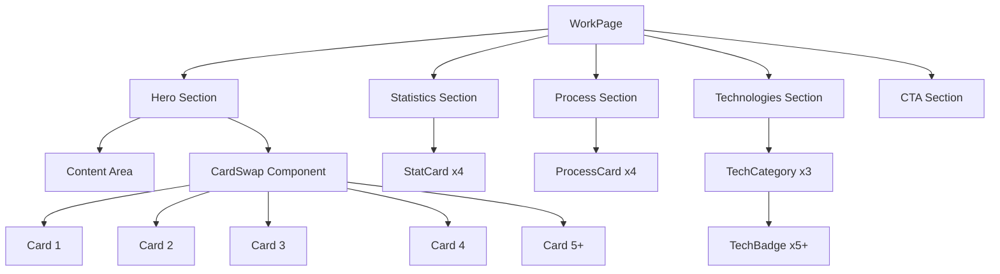
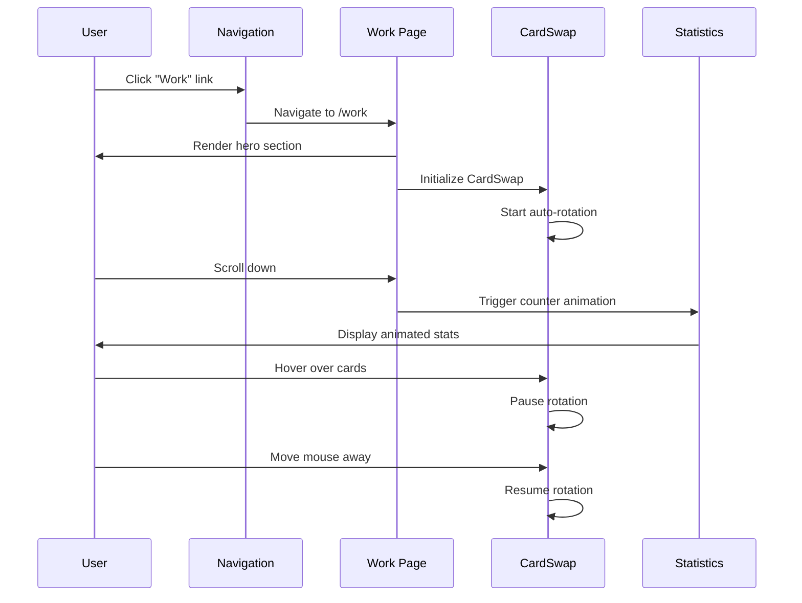
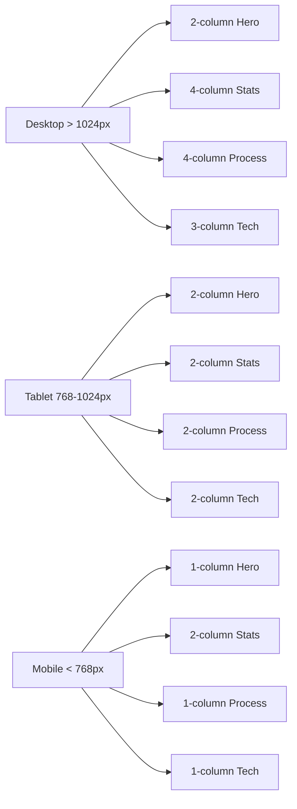

# Work Page Design Document

## Overview

The Work page will serve as PICABORD's portfolio showcase, demonstrating the company's technical capabilities, project experience, and expertise across both hardware (PIKA) and software (TEC) divisions. The page will feature an engaging, interactive design that combines animated visual elements with informative content sections, maintaining consistency with the existing PICABORD website design language.

The page will be built using Next.js 14+ with TypeScript, leveraging the existing component library and design system. The layout will be fully responsive, adapting seamlessly from desktop to mobile viewports.

## Architecture

### Page Structure

```
/app/work/page.tsx (Next.js App Router)
├── Hero Section (with CardSwap Component)
├── Statistics Section
├── Process Section
├── Technologies Section
└── Call-to-Action Section
```

### Component Hierarchy

```
WorkPage
├── Navigation (existing component)
├── HeroSection
│   ├── ContentArea (left side)
│   └── CardSwap (right side)
│       └── Card[] (example images)
├── StatisticsSection
│   └── StatCard[] (animated counters)
├── ProcessSection
│   └── ProcessCard[] (workflow phases)
├── TechnologiesSection
│   ├── TechCategory[]
│   │   └── TechBadge[]
└── CTASection
    └── Button (contact link)
```

## Components and Interfaces

### 1. Work Page Component

**File:** `app/work/page.tsx`

```typescript
'use client'

export default function WorkPage() {
  return (
    <div className="min-h-screen bg-gradient-to-br from-background/50 to-muted/10">
      {/* Sections */}
    </div>
  );
}
```

**Responsibilities:**
- Orchestrate all page sections
- Manage scroll animations
- Handle responsive layout

### 2. CardSwap Component (Provided)

**File:** `components/CardSwap.tsx` (to be created)

The CardSwap component is provided by the user and will be integrated as-is. Key configuration:

```typescript
<CardSwap
  width={500}
  height={400}
  cardDistance={60}
  verticalDistance={70}
  delay={5000}
  pauseOnHover={true}
  skewAmount={6}
  easing="elastic"
>
  {/* Card children with example images */}
</CardSwap>
```

### 3. Hero Section with CardSwap

**Layout:**
- Desktop: Two-column grid (60% content / 40% CardSwap)
- Tablet: Two-column grid (50% / 50%)
- Mobile: Single column (content stacked above CardSwap)

**Content Structure:**
```typescript
interface HeroContent {
  heading: string;
  subheading: string;
  description: string;
  techStacks: string[];
}
```

**Example Content:**
- Heading: "Our Work"
- Subheading: "Crafting Digital Excellence"
- Description: Multi-paragraph text about PICABORD's work, mentioning PIKA and TEC divisions
- Tech stacks: MERN, Next.js, TypeScript, GSAP, Tailwind CSS, etc.

### 4. Statistics Section

**Layout:**
- Grid of 4 statistics cards
- Desktop: 4 columns
- Tablet: 2 columns
- Mobile: 2 columns (smaller cards)

**Data Structure:**
```typescript
interface Statistic {
  value: number;
  label: string;
  suffix?: string;
  prefix?: string;
}

const statistics: Statistic[] = [
  { value: 50, label: "Projects Completed", suffix: "+" },
  { value: 5, label: "Years Experience", suffix: "+" },
  { value: 20, label: "Technologies", suffix: "+" },
  { value: 100, label: "Client Satisfaction", suffix: "%" }
];
```

**Animation:**
- Use GSAP or React hooks to animate numbers counting up
- Trigger animation when section enters viewport
- Duration: 2 seconds with easing

### 5. Process Section

**Layout:**
- 4 process cards in a responsive grid
- Desktop: 4 columns
- Tablet: 2 columns
- Mobile: 1 column

**Data Structure:**
```typescript
interface ProcessPhase {
  number: string;
  title: string;
  description: string;
  icon: React.ComponentType;
}

const processPhases: ProcessPhase[] = [
  {
    number: "01",
    title: "Discovery & Planning",
    description: "We analyze requirements, define scope, and create a comprehensive project roadmap.",
    icon: SearchIcon
  },
  // ... 3 more phases
];
```

**Visual Design:**
- Each card has a large number indicator (01, 02, 03, 04)
- Icon at the top
- Title and description
- Subtle hover effects (elevation, border glow)

### 6. Technologies Section

**Layout:**
- 3 category columns
- Desktop: 3 columns
- Tablet: 2 columns (third wraps)
- Mobile: 1 column

**Data Structure:**
```typescript
interface TechCategory {
  name: string;
  technologies: Technology[];
}

interface Technology {
  name: string;
  icon?: string;
  color?: string;
}

const techCategories: TechCategory[] = [
  {
    name: "Frontend",
    technologies: [
      { name: "React", color: "#61DAFB" },
      { name: "Next.js", color: "#000000" },
      { name: "TypeScript", color: "#3178C6" },
      { name: "Tailwind CSS", color: "#06B6D4" },
      { name: "GSAP", color: "#88CE02" }
    ]
  },
  {
    name: "Backend",
    technologies: [
      { name: "Node.js", color: "#339933" },
      { name: "Express", color: "#000000" },
      { name: "MongoDB", color: "#47A248" },
      { name: "PostgreSQL", color: "#4169E1" },
      { name: "Redis", color: "#DC382D" }
    ]
  },
  {
    name: "DevOps & Tools",
    technologies: [
      { name: "Docker", color: "#2496ED" },
      { name: "Git", color: "#F05032" },
      { name: "AWS", color: "#FF9900" },
      { name: "Vercel", color: "#000000" },
      { name: "GitHub Actions", color: "#2088FF" }
    ]
  }
];
```

**Visual Design:**
- Technology badges with hover effects
- Optional: Color-coded borders based on technology color
- Grid layout within each category

### 7. Call-to-Action Section

**Layout:**
- Centered content
- Similar to existing CTA sections on other pages

**Content:**
- Heading: "Ready to Start Your Project?"
- Subheading: "Let's collaborate and bring your vision to life"
- Button: "Get in Touch" (links to /contact)

**Visual Design:**
- Gradient background or border
- Animated button with glow effect (matching existing patterns)
- Ample padding for visual breathing room

## Data Models

### Page Content Model

```typescript
interface WorkPageContent {
  hero: {
    heading: string;
    subheading: string;
    paragraphs: string[];
    techHighlights: string[];
  };
  examples: {
    images: string[];
    video?: string;
  };
  statistics: Statistic[];
  process: ProcessPhase[];
  technologies: TechCategory[];
  cta: {
    heading: string;
    subheading: string;
    buttonText: string;
    buttonLink: string;
  };
}
```

### Animation State Model

```typescript
interface AnimationState {
  heroVisible: boolean;
  statsVisible: boolean;
  processVisible: boolean;
  techVisible: boolean;
  ctaVisible: boolean;
}
```

## Error Handling

### Image Loading

- **Strategy:** Use Next.js Image component with fallback
- **Error State:** Display placeholder or skip card if image fails to load
- **Implementation:**
  ```typescript
  <Image
    src={imagePath}
    alt={altText}
    fill
    className="object-cover"
    onError={(e) => {
      console.error('Image failed to load:', imagePath);
      // Hide card or show placeholder
    }}
  />
  ```

### Animation Failures

- **Strategy:** Graceful degradation - content displays without animation
- **Error State:** Static content with no motion
- **Implementation:**
  ```typescript
  try {
    // GSAP animation code
  } catch (error) {
    console.error('Animation failed:', error);
    // Display static content
  }
  ```

### Responsive Layout Issues

- **Strategy:** Mobile-first approach with progressive enhancement
- **Breakpoints:**
  - Mobile: < 768px
  - Tablet: 768px - 1024px
  - Desktop: > 1024px
- **Testing:** Test on multiple viewport sizes

## Testing Strategy

### Unit Tests

**Components to Test:**
1. WorkPage component rendering
2. Statistics counter animation logic
3. Technology badge rendering
4. Process card rendering

**Test Cases:**
```typescript
describe('WorkPage', () => {
  it('renders all sections', () => {
    render(<WorkPage />);
    expect(screen.getByText(/Our Work/i)).toBeInTheDocument();
    expect(screen.getByText(/Projects Completed/i)).toBeInTheDocument();
  });

  it('displays correct number of example images', () => {
    render(<WorkPage />);
    const cards = screen.getAllByRole('img');
    expect(cards.length).toBeGreaterThanOrEqual(5);
  });
});
```

### Integration Tests

1. **Navigation Integration:**
   - Verify "Work" link appears in navigation
   - Verify clicking link navigates to /work
   - Verify active state on Work page

2. **CardSwap Integration:**
   - Verify cards rotate automatically
   - Verify pause on hover functionality
   - Verify responsive scaling

3. **Scroll Animations:**
   - Verify sections animate on scroll
   - Verify statistics counter triggers correctly

### Visual Regression Tests

- Capture screenshots at different viewport sizes
- Compare against baseline images
- Test dark/light theme variations

### Accessibility Tests

1. **Keyboard Navigation:**
   - Tab through all interactive elements
   - Verify focus indicators

2. **Screen Reader:**
   - Test with NVDA/JAWS
   - Verify ARIA labels
   - Verify semantic HTML structure

3. **Color Contrast:**
   - Verify WCAG AA compliance
   - Test with color blindness simulators

### Performance Tests

1. **Lighthouse Audit:**
   - Target: 90+ performance score
   - Target: 100 accessibility score
   - Target: 90+ SEO score

2. **Image Optimization:**
   - Verify Next.js Image optimization
   - Check lazy loading implementation
   - Monitor bundle size

3. **Animation Performance:**
   - Monitor FPS during animations
   - Check for layout shifts
   - Verify smooth scrolling

## Design Specifications

### Typography

- **Headings:** Font family from existing design system
- **Body Text:** 16px base, 1.5 line height
- **Section Titles:** 3xl to 5xl responsive
- **Card Text:** lg to xl

### Color Palette

Using existing design tokens:
- `primary`: Main brand color
- `muted-foreground`: Secondary text
- `border`: Card borders
- `background`: Page background
- `chart-1`, `chart-2`: Accent colors for gradients

### Spacing

- **Section Padding:** py-16 to py-24
- **Container Max Width:** max-w-7xl
- **Card Gaps:** gap-6 to gap-8
- **Content Padding:** px-4 sm:px-6 lg:px-8

### Animations

1. **Fade In Up:**
   - Duration: 700ms
   - Easing: ease-out
   - Translate: 0 to 8px

2. **Counter Animation:**
   - Duration: 2000ms
   - Easing: ease-out
   - Trigger: Intersection Observer

3. **Hover Effects:**
   - Scale: 1.02 to 1.05
   - Duration: 300ms
   - Easing: ease-in-out

### Responsive Breakpoints

```css
/* Mobile First */
.container {
  /* Base: < 768px */
  padding: 1rem;
}

@media (min-width: 768px) {
  /* Tablet */
  .container {
    padding: 1.5rem;
  }
}

@media (min-width: 1024px) {
  /* Desktop */
  .container {
    padding: 2rem;
  }
}
```

## Implementation Notes

### CardSwap Component Integration

1. Create `components/CardSwap.tsx` with provided code
2. Import into Work page
3. Configure with example images from `/public` folder
4. Wrap images in Card components with proper styling

### Navigation Update

Add "Work" link to Navigation component:

```typescript
const sections = [
  { id: "solutions", label: "Solutions" },
  { id: "work", label: "Work" }, // NEW
  { id: "blog", label: "Blog" },
  { id: "about", label: "About" }
];
```

### Content Strategy

**Hero Section Content:**
- Emphasize both hardware and software capabilities
- Mention specific technologies (MERN, Next.js, TypeScript, GSAP, etc.)
- Highlight unique value proposition
- Keep tone professional yet approachable

**Statistics:**
- Use realistic, achievable numbers
- Focus on metrics that matter to clients
- Update periodically as company grows

**Process Phases:**
1. Discovery & Planning
2. Design & Architecture
3. Development & Testing
4. Deployment & Support

**Technologies:**
- Group logically (Frontend, Backend, DevOps)
- Include 15+ technologies
- Prioritize commonly used stacks
- Consider adding hardware-specific tools for PIKA

### Accessibility Considerations

1. **Semantic HTML:**
   ```html
   <main>
     <section aria-labelledby="hero-heading">
       <h1 id="hero-heading">Our Work</h1>
     </section>
   </main>
   ```

2. **ARIA Labels:**
   - Add aria-label to CardSwap container
   - Add aria-live for counter animations
   - Add role="list" for technology grids

3. **Focus Management:**
   - Ensure all interactive elements are keyboard accessible
   - Provide visible focus indicators
   - Skip links for long content

4. **Alt Text:**
   - Descriptive alt text for all example images
   - Format: "Project screenshot showing [description]"

### Performance Optimization

1. **Image Optimization:**
   - Use Next.js Image component
   - Implement lazy loading
   - Serve WebP format with fallbacks
   - Optimize image dimensions

2. **Code Splitting:**
   - Dynamic import for CardSwap if large
   - Lazy load sections below fold
   - Minimize initial bundle size

3. **Animation Performance:**
   - Use CSS transforms (GPU accelerated)
   - Avoid animating layout properties
   - Use `will-change` sparingly
   - Implement Intersection Observer for scroll animations

## Mermaid Diagrams

### Component Structure



### User Flow



### Responsive Layout Flow



## Dependencies

### Required Packages

- `next`: ^14.0.0 (already installed)
- `react`: ^18.0.0 (already installed)
- `typescript`: ^5.0.0 (already installed)
- `gsap`: ^3.12.0 (already installed)
- `tailwindcss`: ^3.0.0 (already installed)
- `lucide-react`: ^0.x.x (already installed for icons)

### New Components to Create

1. `components/CardSwap.tsx` - Provided by user
2. `app/work/page.tsx` - Main Work page component

### Existing Components to Use

1. `components/Navigation.tsx` - Update with Work link
2. `components/ui/card.tsx` - For various card layouts
3. `components/ui/button.tsx` - For CTA button
4. `components/ui/badge.tsx` - For technology badges
5. `hooks/use-scroll-animation.ts` - For scroll-triggered animations

## Summary

The Work page design provides a comprehensive showcase of PICABORD's capabilities through an engaging, interactive experience. The page maintains design consistency with existing pages while introducing unique elements like the CardSwap component. The modular architecture ensures maintainability, and the responsive design guarantees accessibility across all devices. Performance and accessibility are prioritized throughout the implementation.
